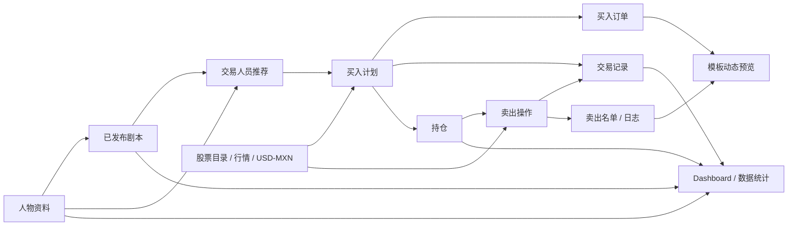

# Pi Web V2 功能架构文档

版本：v0.1（功能迁移分析稿）  
日期：2026-08-02  
范围：Pi 原 Electron 桌面系统 → Pi Web V2  
本轮性质：只做功能盘点与迁移规划，不修改桌面端或 Web V2 业务代码。

## 1. 文档目标

本次迁移不以“逐屏复制”为目标，而以“保留业务事实、重构 Web 使用方式”为目标：

1. 保留原系统已经存在的业务模块、数据字段、计算关系和买卖执行语义。
2. 不把桌面端演示数据、硬编码状态、模拟曲线或装饰性文案迁移成 Web V2 的真实业务数据。
3. 将桌面端单页、内存状态和 `localStorage` 结构整理成可持续接入数据库/API 的 Web 模块边界。
4. 优化高密度桌面工作区、表格操作、路由状态、错误/空状态和跨页面数据一致性，但不新增未经确认的业务功能。

## 2. 分析依据与成熟度口径

### 2.1 事实来源

- 页面结构：`renderer/index.html`
- 页面交互：`assets/js/*.js`
- 统一业务数据：`assets/js/data-manager.js`
- 桌面演示种子：`assets/js/mock-data.js`、`assets/data/people.json`
- Electron 行情与截图通道：`main.js`、`preload.js`
- 原系统约束：`README.md`、`UI-SYSTEM.md`
- Web V2 现有路由与类型：`pi-web-v2/src/app`、`pi-web-v2/src/modules`

### 2.2 功能成熟度定义

| 标签 | 定义 | 迁移处理 |
|---|---|---|
| 已实现 | 页面、事件处理和数据读写链路均存在 | 保留业务能力与语义 |
| 部分实现 | 页面和部分交互存在，但存在未接线字段、口径冲突或只影响本机状态 | 保留入口，先修正数据契约 |
| 展示占位 | 值、趋势、状态或列表来自硬编码/模拟生成 | 只迁移 UI 结构，Web 中使用空状态或真实数据源 |
| 隐藏依赖 | 不在主导航中，但被其他业务读取 | 保留服务能力，不可删除 |

## 3. 总体结论

Pi 原系统真正的主业务链不是菜单列表，而是以下闭环：

另有两个边界明确的子系统：

- **大宗交易预留**：独立于 `PiData`，当前只有金额和折扣配置持久化；机构列表和趋势属于演示内容。
- **模板工程**：工程文件独立保存在 `pi-template-projects-v2`，但会读取最新买入订单、卖出记录和 VIP 人数生成预览。

因此，Web V2 应形成四个数据域：

1. 人物与运营域：人物、分组、VIP、开户、剧本参与。
2. 交易与资产域：股票目录、汇率、订单、成交、持仓、卖出记录。
3. 内容域：模板目录、模板工程、图片导出。
4. 机构预留域：预留配置、机构配额、窗口和状态；保持独立。

## 4. 全部功能模块盘点

| 模块 | 原桌面路由/页面 | 当前能力 | 成熟度 | Web V2 归属 |
|---|---|---|---|---|
| 登录 | 登录屏 | 用户名、密码、显隐密码、记住账号外观、登录/退出 | 部分实现：只校验非空，没有真实账号认证 | `/login` + Auth/Session |
| 应用框架 | AppShell | Sidebar、返回栈、全局搜索、快捷键、主题、全屏、退出 | 已实现 | 全局 Layout |
| Dashboard | `dashboard` | 运营 KPI、资产汇总、买卖入口、72 小时持仓、人员推荐、趋势、市场条 | 已实现，但依赖种子数据 | `/dashboard` |
| 美股/墨股市场 | `markets` 的 US/MX Tab | 指数实时值、K 线、周期、状态、截图、失败重试 | 已实现 | `/market/us`、`/market/mexico` |
| 人物中心 | `people` | 统计、筛选、搜索、排序、分页、导入、人物详情入口 | 已实现 | `/clients` |
| 人物详情 | `person-detail` | 资产、交易、盈亏、账户、日志、编辑人物资料 | 已实现 | `/clients/[id]` |
| 交易总览 | `trading` | 总资产、浮盈、持仓市值、资金、趋势、持仓概览、分布、快捷入口 | 部分实现：主要展示可用，时间范围未接线 | `/trading` |
| 买入交易 | `trading` 四阶段流程 | 行情/汇率、剧本推荐、资金规则、名单确认、写入订单/交易/持仓 | 部分实现：推荐与数据写入存在，确认阶段交互未完整接线 | `/trading` 内买入流程 |
| 持仓管理 | 隐藏 `positions` 视图 | 统计、趋势、分布、筛选、分页、股票详情、导出 | 隐藏且含模拟趋势 | `/trading` 内持仓子视图 |
| 股票详情 | `stock-detail` | 标的汇总、持仓人员、行情图、操作记录、进入卖出 | 部分实现，部分行情字段硬编码 | `/trading` 内标的详情 |
| 卖出交易 | `sell` | 选标的、选人员、折扣、预览、确认、执行、名单、导出 | 已实现，费用/到账口径待确认 | `/trading` 内卖出流程 |
| 大宗交易预留 | `stocks` | 金额/折扣、预留/可用、机构表、窗口、日历 | 展示占位为主 | `/institutional` |
| 剧本助手 | `scripts` | 人物发言排序、富文本编辑、预览、发布、参与统计 | 隐藏依赖 | 内部服务/后续受控入口 |
| 模板中心 | `promotion` | 模板统计、分类、搜索、上传、新建、使用、删除 | 已实现 | `/templates` |
| 模板编辑器 | `template-editor` | 文字/图片/Logo/背景/图形、图层、属性、撤销重做、保存、PNG 导出 | 已实现，自动保存文案与实际行为不一致 | `/templates` 内编辑流程 |
| 数据统计 | `reports` | 人物、活跃、交易、持仓、剧本、趋势、收益、最近交易、导出 | 部分实现，部分指标为展示算法 | 当前 Web V2 缺少明确归属 |
| 设置/数据管理 | `settings` | 外观设置、导入、数据计数、备份恢复、系统信息 | 部分实现 | `/settings` |

## 5. 重点模块详细分析

## 5.1 人物中心（Centro de Clientes）

### 已有功能

- 展示人物总量、VIP 开户/未开户、今日新增、男女比例、运营小组数量。
- 展示小组人员分布和任务状态结构。
- 按人物类型、开户/跟进状态、VIP 状态筛选。
- 按编号、姓名、年龄、余额、今日交易、今日发言排序。
- 搜索编号、姓名、手机号、地区和小组。
- 分页，每页 10 条。
- 导入 JSON/CSV 人物数据，并进入统一数据流程。
- 点击人物进入详情页，路由状态保存 `personId`。

### 目录页已有字段

| 区域 | 字段 |
|---|---|
| 统计卡 | 总人数、VIP 已开户/未开户、今日新增、男女比例、运营小组 |
| 列表 | 编号、头像/姓名、等级、所属小组、性别、年龄、地区、手机号、状态、账户资金 MXN、今日交易、今日发言、操作 |
| 筛选 | VIP 状态、开户/未开户/跟进中、人物类型、搜索词 |
| 辅助分析 | 小组人员分布、已开户人数、VIP 人数、跟进人数 |

### 详情页已有功能与字段

| 页面区块 | 字段/能力 |
|---|---|
| 身份摘要 | 人物编号、类型、姓名、VIP、开户状态、性别、年龄、地区、小组、手机号、票型 |
| 金融卡片 | 账户净值、总盈亏、持仓市值、历史胜率 |
| 基本信息 | 客户编号、VIP 等级、所属小组、开户状态、推荐人、风险等级、最后登录、备注 |
| 资产总览/盈亏分析 | 净值趋势、盈亏分布、行业分布、7/30/90 天 |
| 持仓明细 | 代码、名称、市场、数量、成本价、现价、市值、盈亏、盈亏比例、操作 |
| 交易记录 | 订单编号、股票代码、类型、数量、成交价、金额、时间、状态、来源 |
| 账户信息 | 余额、累计投入、累计收益、买票规则、最低股数、最大资金比例、票型、小组、开户状态 |
| 资料日志 | 时间、模块、操作、对象、状态；由交易和卖出记录临时聚合 |
| 可编辑字段 | 姓名、人物类型、小组、开户状态、VIP、年龄、余额、累计投入、累计收益、最低股数、最大资金比例、买票规则、票型 |

### 数据关系

- `personId` 是人物、持仓、交易、剧本参与者的主要关联键。
- 人物的 `accountStatus`、`balance`、`minimumShares`、`maxFundRatio` 决定能否进入买入推荐及最大购买能力。
- `todayTrades` 由买入和卖出执行累加。
- `todaySpeech`、`totalSpeech` 由剧本发布时按参与次数累加。
- 修改 `personId` 时，桌面端会同步持仓、交易和已发布剧本；当前没有同步 `orders` 与 `sellLogs`，属于 Web 迁移时必须解决的引用一致性风险。

### 必须保留

- 四类人物：老男、老女、新男、新女。
- 五个实际运营小组：仔仔、坤坤、达子、金海、吉祥。
- 开户、VIP、跟进、余额、购买规则和剧本参与关系。
- 目录 → 详情 → 持仓/交易/账户的完整下钻。
- JSON/CSV 导入、人物编号唯一性校验和跨模块同步。

### 适合 Web 优化

- 筛选、排序、分页写入 URL 查询参数，刷新或返回后保留工作上下文。
- 高密度表格采用固定表头、固定身份列、横向滚动和可控列宽；不改变字段。
- 详情页按 Tab 延迟读取持仓/交易，减少首次加载量。
- 编辑保存统一走人物服务，并由服务保证关联键级联一致性。
- 导入先提供字段映射与校验结果，再提交统一数据层；这是对现有导入的安全化，不改变数据范围。

### 已发现的迁移差异

1. 原桌面人物列表字段是“今日发言”；当前 Web V2 `Client` 类型使用“今日盈亏”。不能直接用后者替换前者。建议保留 `todaySpeech`，`todayProfitLoss` 只有在业务明确要求并有真实计算源后再展示。
2. 桌面页面存在 A/B/C“小组筛选”外观，但实际人物使用五个中文小组，且该控件未参与筛选逻辑；Web 应以真实五组为准。
3. 原系统称“人物”，Web 路由称 `clients`。可保留西语界面名称 Centro de Clientes，但数据模型建议仍明确映射 `Person ↔ Client`，避免字段丢失。

## 5.2 买入交易

### 已有页面结构

1. 交易总览：资产卡、资产趋势、持仓概览、持仓分布、买入/卖出/导出入口。
2. 交易终端外观：市场、票型、股票、折扣、订单类型、价格、数量、金额摘要。
3. 四阶段买入工作流：创建任务 → 推荐人员 → 确认订单 → 执行完成。

### 实际接线状态

- 创建任务表单、联网更新个股行情/汇率和“从当前剧本推荐人员”已经接线。
- `DataManager.executeBuy` 已具备写入订单、交易、持仓和人物资金的完整数据逻辑。
- 推荐页的筛选、搜索、重置、复制、接受/拒绝、确认生成订单，及第三阶段同意勾选没有完整事件链。
- 代码中没有进入第三阶段的调用，执行按钮默认禁用；因此桌面 UI 不能按页面设计顺畅完成四阶段闭环。
- “任务记录”Tab 和交易终端中的订单类型/盘口/最近成交主要是页面结构，不应被描述为已经可用的业务功能。

### 已有字段

| 阶段 | 字段 |
|---|---|
| 创建任务 | 任务编号、创建时间、执行周期、市场类型、股票等级/票型、股票代码、股票名称、实时行情状态、计价货币、USD/MXN、推荐人数、每人资金占比、市场价、折扣、买入日期 |
| 规则预览 | 当前剧本、剧本人物池、人物购买规则、预计总金额、总股数、平均资金 |
| 推荐名单 | 人物编号、类型、姓名、小组、VIP/常规、购买资金、推荐股数、折扣、接受/拒绝 |
| 筛选 | 人物类型、小组、VIP、编号/姓名/类型搜索 |
| 确认订单 | 编号、人物、类型、股票、买入价、折扣、金额、股数、状态、风险检查、确认勾选 |
| 完成 | 订单号、实际写入持仓/交易数量、返回 Dashboard、进入卖出 |

### 现有推荐规则

- 必须先存在包含人物的当前已发布剧本。
- 候选人物需要已开户且余额大于 0。
- 每人预算上限为 `balance × maxFundRatio`，同时受到任务级资金占比限制。
- 购买股数不得低于 `minimumShares`。
- 按今日交易次数、历史交易次数、VIP、人物编号排序。
- 人员可接受、拒绝或修改股数。

### 买入执行对数据的影响

- 人物余额减少买入金额。
- 人物 `todayTrades + 1`，`invested` 增加。
- 新增一条买入 `order`。
- 每位成功参与者新增一条 `transaction` 和一条 `holding`。
- 美股金额按执行时 USD/MXN 汇率换算为 MXN；持仓同时保留原币价格和 MXN 价格。

### 必须保留

- “剧本人物池 + 人物资金规则”是推荐前置条件，剧本功能即使不在主导航也不能删除。
- 市场价、汇率、折扣、资金占比、最低股数和余额校验。
- 推荐名单可人工调整后再确认。
- 执行一次性写入订单、交易、持仓和人物余额，必须保持原子一致。
- 行情不可用时显示不可用，不能用随机值代替。

### 适合 Web 优化

- 将四阶段流程保持在 `/trading` 的稳定工作区，当前阶段和草稿状态可恢复。
- 推荐结果显示“纳入/排除原因”，但不改变原排序和资格规则。
- 由服务端重新执行余额、最低股数、资金比例和价格校验，防止只依赖浏览器校验。
- 行情与汇率使用共享 Quote Service；美股和墨股复用同一交易表单，仅切换货币和交易所规则。
- 提交时使用幂等任务编号，防止重复点击产生重复订单；属于执行安全，不是新业务。

### 待确认业务差异

1. 当前代码在“已有剧本但严格资格池为空”时，会退回到全体人物中的低发言/低交易人员。该行为会绕过已开户、余额和剧本资格结果，应由业务方确认是兼容规则还是桌面演示兜底。
2. 页面有“买入日期”字段，但当前执行始终使用系统当前时间，字段没有写入订单。
3. 页面同时存在“交易终端”和“四阶段工作流”，但终端以展示为主，四阶段流程也尚未完整接线。Web 应以已经存在的推荐规则和 `executeBuy` 数据语义为基础，先确认一个主流程。

## 5.3 卖出交易与持仓

### 已有功能

- 从 Dashboard 72 小时持仓、交易中心、股票详情进入卖出。
- 按股票汇总持仓人数、数量、成本、市值、浮盈和可卖数量。
- 选择标的和人物持仓；锁定状态不可在页面中选择。
- 设置 0–20% 卖出折扣。
- 预览成交价、人数、股数、金额、手续费、净到账、成交窗口和 T+2。
- 勾选协议后执行卖出。
- 查看、筛选、搜索和导出真实卖出人员名单。

### 已有字段

| 区域 | 字段 |
|---|---|
| 标的摘要 | 股票代码、名称、持仓总量、可卖数量、平均成本、当前价、浮动盈亏 |
| 人员选择 | 人物编号/类型、姓名、头像、小组、VIP、备注、选择/锁定状态 |
| 参数 | 折扣率、全部可卖数量、预计成交价、预计成交时间、结算周期 |
| 预览 | 股票代码、名称、参与人数、卖出数量、预计成交金额、手续费、净到账金额 |
| 卖出记录 | 人物、姓名、小组、VIP、股票代码、股票名称、备注 |

### 卖出执行对数据的影响

- 以 `currentPrice × (1 - discount)` 计算成交价。
- 人物余额增加成交金额，`todayTrades + 1`。
- 新增卖出 `transaction` 与 `sellLog`。
- 计算 `profit = (卖出 MXN 价 - 成本 MXN 价) × 股数`。
- 删除已卖出的持仓记录。

### 必须保留

- 按持仓记录选择人员，不能只按股票总量卖出。
- 锁定/可卖状态、折扣范围、确认勾选和卖出后不可逆提示。
- 卖出后人物资金、交易记录、卖出名单和持仓必须同步。
- 卖出名单筛选和 CSV 导出。
- 72 小时待处理持仓与卖出入口之间的关联。

### 适合 Web 优化

- 持仓总览、标的详情和卖出流程作为 `/trading` 下的连续上下文，保留返回位置。
- 表格和选择状态由持仓 ID 驱动，服务端再次验证持仓仍存在且仍可卖。
- 使用统一货币服务计算原币、汇率和 MXN 金额，消除不同页面的单位混用。
- 交易提交成功后只以服务端返回结果更新列表，避免浏览器本地先删持仓。

### 待确认业务差异

1. 页面预览按 0.2% 计算手续费和净到账，但当前 `executeSell` 将未扣手续费的成交总额写回人物余额。手续费是否真实扣除必须先确认。
2. 页面显示 18:00–20:00、T+2 和“大宗交易协议”，但执行记录没有保存成交窗口、结算状态或协议版本；当前属于展示字段。
3. 数据层执行卖出时没有再次校验持仓状态，只有页面禁止选择“锁定中”。Web 服务必须至少执行同一资格校验。

## 5.4 美股市场与墨股市场

### 已有功能

- 原桌面端一个 `markets` 页面，用 US/MX Tab 切换。
- 美股基准：S&P 500 `^GSPC`；墨股基准：IPC México `^MXX`。
- 周期：1D、5D、1M、3M、6M、YTD、1Y、5Y、All。
- 展示价格、涨跌额、涨跌幅、市场状态、日高/低、52 周高/低、货币、更新时间。
- K 线、MA5、成交量、缩放。
- 每 15 秒刷新两个市场的指数报价。
- 请求失败时清空图表并显示不可用和 Retry。
- Snapshot 导出当前市场卡和图表区域 PNG。

### 数据关系

- 桌面 Electron 主进程通过 Yahoo Finance Chart API 获取指数 K 线和 Meta。
- 买入页另行使用相同 Chart API 获取个股和 `MXN=X` 汇率。
- 指数页面的 `^GSPC/^MXX` 数据不会自动更新交易域的个股 `stockCatalog`。
- 持仓估值目前主要使用存储在 `stockCatalog/holding` 中的价格，而不是指数页的实时数据。

### 必须保留

- 两个市场、全部周期、实时 Meta、K 线、成交量、失败状态、重试和截图。
- Yahoo Finance 返回值是当前桌面口径；更换数据源必须显式配置，不能混合多个口径。
- 行情失败时不能回退到随机价格或伪实时缓存。

### 适合 Web 优化

- Web 路由拆成 `/market/us` 与 `/market/mexico`，但底层共用 Market Service、周期配置、图表组件和错误处理。
- 周期写入 URL，支持刷新与分享当前市场视图。
- 服务器代理第三方行情，统一超时、缓存时长、限流和错误格式；不在浏览器暴露上游细节。
- 指数行情、个股行情和 FX 明确分为三种数据类型，避免“指数已实时”被误解为持仓价格已更新。

## 5.5 大宗交易预留（Reserva Institucional）

### 已有页面结构与字段

| 区域 | 字段 |
|---|---|
| 状态栏 | CDMX 时间、刷新说明、预留开放/下次开放状态 |
| 可编辑配置 | Monto Total（MXN）、% Descuento |
| KPI | Acciones Reservadas、Cupo Disponible、Monto Total、Mercado BMV |
| 趋势 | 预留股数演变、可用容量演变 |
| 机构表 | Ticker、Institución、Monto Total、% Descuento、Acciones Reservadas、Cupo Disponible、Estado、Última Actualización |
| 筛选 | Ticker/机构搜索、状态筛选、Ticker/金额/折扣/预留/可用排序 |
| 运营信息 | 夜间预留窗口、BMV 操作窗口、关闭时段、运营日历 |

### 当前真实实现边界

- `amount` 和 `discount` 保存到独立键 `pi-reservation-config`。
- 不读取、不修改 `PiData`，与人物买卖/持仓完全隔离。
- 机构表、预留/可用总数、趋势点、窗口倒计时文本均由页面脚本硬编码或计算生成。
- 页面写“每 30 秒实时更新”，实际代码只有时钟每秒更新，没有机构数据刷新源。

### 必须保留

- 独立业务域和独立品牌/Logo，不与 Pi 普通业务 Logo 混用。
- 金额、折扣、预留容量、机构状态、交易窗口和运营日历的页面结构。
- 搜索、状态筛选、排序和配置保存语义。

### 适合 Web 优化

- 在真实 Reservation Service 接入前，展示明确空状态/未连接状态，不迁移硬编码机构记录和趋势。
- 时间与窗口状态统一按 `America/Mexico_City` 计算。
- 配置编辑采用显式保存与错误反馈；机构数据刷新状态来自真实响应时间。
- 保持与交易域的服务、权限和缓存隔离；若未来需要联动，必须另行定义业务接口。

## 5.6 剧本助手（隐藏依赖）

### 已有功能

- 按累计/今日发言次数从少到多推荐人物。
- 双击人物写入富文本剧本。
- 识别“编号 + 人物类型 + 冒号”格式，统计参与人及出现次数。
- 富文本格式、字体、颜色、对齐、撤销/重做、插图。
- 草稿自动保存、聊天样式预览、发布、删除。
- 发布后写入 `publishedScripts`，并增加人物发言次数。
- 买入人员推荐读取最新已发布剧本的 `participantIds`。

### 已有字段

- 剧本：`id`、`title/name`、`ticker`、`version`、`publisher`、`publishedAt`、`participantIds`、`participantCounts`、`html`。
- 人物选择：编号、类型、姓名、小组、VIP、发言次数、交易次数。
- 编辑统计：字数、行数、保存状态、保存时间。

### 迁移原则

- 即使 Web V2 当前主导航没有剧本中心，也必须保留最新剧本、参与人物和推荐依赖。
- 若暂不迁移编辑页面，至少先迁移脚本数据模型、当前脚本读取和推荐服务契约。
- 删除剧本草稿不能误删已经发布并被历史交易引用的脚本记录。

## 5.7 模板中心

### 已有功能

- 内置四类模板：机构机会单栏、机构机会双栏、买入信号、卖出信号。
- 模板统计、分类筛选、名称/副标题/适用范围搜索。
- 上传 PNG/JPG/JPEG/WebP，支持多文件和拖放。
- 新建、使用、编辑、保存、删除自定义模板。
- 动态预览最新买入订单、最新卖出记录和 VIP 人数。
- 编辑器支持文字、图片、Logo、背景、装饰图形、图层显隐/锁定/排序、对象属性、复制/删除、撤销/重做、缩放。
- 画布 16:9，导出 4K/8K PNG。

### 模板工程字段

- 工程：`id`、`name`、`version`、`category`、`applicable`、`templateType`、`usageCount`、`updatedAt`、`background`、`nodes`。
- 节点：`className` + `attrs`，包含位置、尺寸、文字、颜色、字体、图片源、角色、锁定和可拖动状态。
- 目录：名称、类型、分辨率、更新时间、预览源、操作。

### 数据关系

- 模板工程实际保存在独立 `pi-template-projects-v2`，并非直接存入 `PiData`。
- 模板预览会读取 `orders`、`sellLogs` 和 `people`。
- README 将模板描述为共用 DataManager，但代码事实是“工程独立存储、预览读取统一业务数据”。Web 应以代码事实为准。

### 必须保留

- 四类现有模板与当前筛选范围。
- 上传、新建、编辑、图层、保存、删除和 PNG 导出。
- 买入/卖出/VIP 的动态预览关系。
- 机构模板使用专用 Logo，普通 Pi 模板使用 Pi Logo，不混用。

### 适合 Web 优化

- 目录和编辑器仍在 `/templates` 业务域内，编辑工程拥有稳定 ID。
- 图片上传、工程保存和导出拆分为明确服务；浏览器内存失败时不丢失已保存工程。
- 真实自动保存必须有保存时间和失败状态；当前“自动保存已开启”只是界面文案，工程仍依赖手动保存。
- 动态预览只显示真实订单/卖出数据；无数据时保留“暂无数据”。

## 5.8 Dashboard 与数据统计

### Dashboard 现有内容

| 层级 | 已有内容 |
|---|---|
| 运营 KPI | 今日新增 VIP、今日开户人数、今日参与交易、当前持仓股票数、今日交易额 |
| 资产汇总 | 总资产、可用资金、持仓市值、浮动盈亏、今日参与人数、今日交易额 |
| 快捷业务 | 进入交易中心、买入、卖出 |
| 风险/时效 | 买入后 72 小时倒计时、股票、购买时间、剩余时间、状态、持有人数 |
| 人员推荐 | 低发言/低交易人物、预计可用资金、预计股数 |
| 趋势 | 交易参与/VIP/开户趋势、VIP/开户增长趋势 |
| 市场条 | 股票目录前五项、USD/MXN |

### 报表中心现有内容

- 统计：总人物、活跃人物、交易记录、持仓价值、剧本记录。
- 趋势：7/30/90/年度交易参与人数和人物活跃人数。
- 业务构成：人物、持仓、交易、剧本。
- 资金趋势：总投入、持仓价值、浮动盈亏。
- 收益分布：盈利、亏损、持平持仓数量。
- 最近交易：交易编号、类型、人物、股票、价格、数量、金额、时间、状态。
- 筛选：全部、买入、卖出、盈利、亏损；搜索人物编号或股票代码。
- 导出：CSV、JSON、Excel 外观文件、打印/PDF。

### 必须保留

- Dashboard 同时保留“资产数据”和“运营数据”，不能用四张资产卡替换原有今日 VIP/开户/参与/交易额指标。
- 所有统计必须从人物、交易、持仓、剧本和行情的统一口径计算。
- 72 小时待处理、人物推荐和买卖入口属于原 Dashboard 的业务能力。
- 报表筛选、时间范围、最近交易和导出能力不能因 Web 当前没有 `/reports` 而丢失。

### 不应迁移为真实业务数据的内容

- 桌面种子人物、持仓、初始交易和脚本。
- 持仓页通过正弦函数生成的历史趋势。
- 股票详情中的固定成交量、市值、日高/日低和备用模拟 K 线。
- 预留中心的固定机构列表、配额与趋势。
- 报表对无盈利字段交易使用 `amount × 4%` 推算盈亏。
- “业务构成”以固定阈值换算百分比，不是实际构成占比。
- 系统 Online/Healthy 等固定展示状态。

### 适合 Web 优化

- Dashboard 首屏按“核心资产 → 原运营 KPI/业务入口 → 市场状态与待处理”组织，保持高密度但不重复取数。
- 业务入口使用已确认路由：Centro de Clientes、Centro de Operaciones、Mercado EE.UU.、Mercado México、Reserva Institucional；不在 Dashboard 自行创造新业务。
- 统计指标建立唯一计算定义，显式记录货币、时区、日期边界和数据更新时间。
- Dashboard 与报表复用同一聚合服务，避免不同页面自行计算出不同结果。
- 大数据量趋势由 API 返回聚合结果，不在浏览器扫描全部交易。

### 当前架构缺口

Web V2 现有路由没有 `/reports`。必须在以下两种方案中确认一种，不能静默删除：

1. 保留独立“数据统计/报表”页面，并增加明确路由；或
2. 将完整报表作为 `/dashboard` 的数据统计子视图，但继续保留时间筛选、交易表和导出。

## 5.9 设置与系统数据管理

### 已有功能与字段

| 区域 | 字段/操作 |
|---|---|
| 系统状态 | 运行状态、数据健康、服务时间、系统版本 |
| 界面设置 | 减少动态效果、自动刷新 30/60 秒/关闭、默认每页 10/20/50 |
| 人物导入 | 选择数据文件、解析状态、导入结果 |
| 数据摘要 | 人物数、交易数、持仓数、已发布剧本数 |
| 系统信息 | 版本、数据模式、预留隔离、图表引擎、渲染模式 |
| 配置状态 | 保存方式、动态效果、刷新频率、每页条数 |
| 备份恢复 | 导出 JSON、恢复 JSON、最多五份本机历史备份 |

### 当前真实实现边界

- 减少动态效果会切换 `body.reduce-motion`。
- 自动刷新和每页条数会保存并广播事件，但人物、持仓和其他页面没有订阅该事件；当前主要是保存/展示，不是真正全局生效。
- 文件选择器显示支持 XLSX/XLS/SQLite/DB，但代码只解析 JSON 和简单 CSV；其他格式会提示先转换。
- 备份包含人物、持仓、交易、订单、卖出日志和已发布剧本。
- 系统状态 Online/Healthy、版本和引擎信息主要是静态展示。

### 必须保留

- 外观偏好、数据计数、JSON/CSV 导入、备份和恢复。
- 导入后所有依赖模块同步刷新。
- 机构预留继续标记为独立存储，不能被统一备份错误覆盖，除非后续明确扩展备份范围。

### 适合 Web 优化

- 只有已真实接线的设置才能启用；未实现项显示说明或禁用。
- 用户级偏好与系统级设置分离；Sidebar 状态、分页偏好等保存到当前用户范围。
- 导入格式与解析器能力保持一致；若未实现 Excel/SQLite，不在文件选择器中宣称支持。
- 备份/恢复在执行前显示内容摘要和校验结果，恢复后以统一数据版本重新加载。

## 5.10 登录、导航与全局框架

### 原桌面已有能力

- 登录字段：用户名、密码、密码显隐、记住账号外观、登录、退出。
- 登录只校验用户名和密码非空，没有账号表、密码校验、角色、状态或持久 Session；“记住账号”没有业务接线。
- Sidebar 支持手动折叠，状态保存在 `pi:sidebar-collapsed`。
- 路由使用历史栈和 Keep Alive，保存页面滚动位置与人物/股票等路由状态。
- 全局搜索覆盖人物、股票和模块，可直接进入人物详情或股票详情。
- 支持返回、移动端抽屉、主题切换、刷新、全屏、退出确认和键盘快捷键。
- Header 的通知按钮只有视觉状态，没有通知业务处理。

### Web V2 迁移原则

- 以 Web V2 已有 Auth Provider、Session 和角色/状态模型替代桌面非空校验。
- 所有业务路由继续由未登录保护；身份用户与人物 Client 是两类模型。
- Sidebar 展开状态、主题和分页偏好按登录用户保存。
- 全局搜索可保留人物、股票、模块三类结果，但结果必须来自真实服务。
- F11、桌面窗口关闭等 Electron 能力不属于 Web 业务，不需要机械复制。

## 6. 核心数据模型

## 6.1 Person / Client

| 类别 | 字段 |
|---|---|
| 身份 | `personId/id`、`name`、`type`、`gender`、`age`、`region`、`phone`、`email` |
| 分组/角色 | `groupName/group`、`groupRole`、`followUp` |
| 账户 | `accountStatus`、`accountOpenedAt`、`vipStatus`、`vipActivatedAt`、`ticketType` |
| 资金 | `balance`、`invested`、`profit` |
| 交易规则 | `buyRule`、`minimumShares`、`maxFundRatio`、`riskLevel` |
| 活跃度 | `todayTrades`、`todaySpeech`、`lastSpeech`、`taskCompletion`、`activities` |
| 人物资料 | `occupation`、`family`、`assetsProfile`、`education`、`language`、`timezone`、`investmentStyle`、`toneStyle`、`catchphrase`、`notes` |

## 6.2 Stock / Quote / FX

- 股票目录：`ticker`、`name`、`market`、`exchange`、`industry`、`price`、`currentPrice`、`discount`、`currency`。
- 行情 Meta：价格、前收、涨跌、日高/低、52 周高/低、状态、货币、更新时间。
- K 线：`time`、`open`、`close`、`low`、`high`、`volume`。
- 汇率：`USDMXN`、`updatedAt`、`source`。

## 6.3 Buy Order / Transaction / Holding

- 买入订单：`id`、`type`、`ticker`、`stockName`、`marketType`、`marketPrice`、`currency`、`exchangeRate`、`ticketType`、`discount`、`discountPrice`、`discountPriceMxn`、`personIds`、`transactionIds`、`createdAt`、`status`。
- 买入交易：订单 ID、人物 ID、股票、原价/折后价、原币/MXN 价格、汇率、票型、股数、金额、时间、状态。
- 持仓：持仓 ID、订单 ID、人物 ID、股票、市场、票型、货币、汇率、股数、原价、折扣、成本价、MXN 成本、当前价、MXN 当前价、状态、买入时间、可卖时间。

## 6.4 Sell Transaction / Sell Log

- `id`、`orderId`、`type`、`personId`、`personName`、`ticker`、`stockName`、`buyPrice`、`sellPrice/price`、`currency`、`exchangeRate`、`shares`、`amount`、`profit`、`createdAt`、`status`。
- 当前卖出不会生成统一 `orders` 记录，而是直接写 `transactions` 和 `sellLogs`；Web 迁移时需保留查询兼容，是否统一订单模型需另行确认。

## 6.5 Script

- `id`、`title/name`、`ticker`、`version`、`publisher`、`participantIds`、`participantCounts`、`html`、`publishedAt`。

## 6.6 Template Project

- `id`、`name`、`version`、`category`、`applicable`、`templateType`、`usageCount`、`updatedAt`、`background`、`nodes`。

## 6.7 Institutional Reservation

- 配置：`amount`、`discount`。
- 机构行目标字段：`ticker`、`institution`、`amount`、`discount`、`reserved`、`available`、`status`、`updatedAt`。
- 当前只有配置是真实本机状态；机构行目标模型来自页面结构，尚无真实数据服务。

## 6.8 User / Session

- 原桌面登录没有真实用户模型，只把输入用户名显示在 Header。
- Web V2 当前已预留：`user_id`、`username`、`password`、`role`、`status` 及本地 Session。
- 该模型属于 Web 访问控制基础设施，不应与人物/Client 模型混用。

## 7. 页面之间的数据关系

| 数据生产者 | 写入/更新 | 主要消费者 |
|---|---|---|
| 人物导入/编辑 | People | 人物目录、详情、推荐、Dashboard、报表、剧本、模板 VIP 预览 |
| 剧本发布 | PublishedScripts、人物发言数 | 买入推荐、Dashboard 排名、报表 |
| 行情/汇率 | Quote、USDMXN | 买入价格、预算校验、持仓估值、市场页 |
| 买入执行 | People、Orders、Transactions、Holdings | 交易总览、人物详情、持仓、Dashboard、报表、模板买入预览 |
| 卖出执行 | People、Transactions、SellLogs，并删除 Holdings | 人物详情、Dashboard、报表、卖出名单、模板卖出预览 |
| 模板编辑 | TemplateProjects | 模板目录与 PNG 导出 |
| 设置导入/恢复 | 多数据集合 | 所有统一数据消费者 |
| 机构预留配置 | 独立 Reservation Config | 仅预留中心 |

### 关键一致性要求

1. 人物 ID 必须唯一且不可产生孤立持仓、订单、交易、卖出日志或剧本参与者。
2. 买入写入四类数据、卖出写入三类数据并删除持仓，应作为单次事务完成。
3. 金额必须携带货币和汇率；跨美股/墨股汇总统一换算 MXN。
4. 日期统计统一使用 `America/Mexico_City` 日界线。
5. Dashboard、人物详情、交易总览和报表必须共享同一计算定义。

## 8. Web V2 路由迁移映射

| 原桌面能力 | Web V2 路由 | 规划 |
|---|---|---|
| 登录 | `/login` | 保留现有 Auth/Session 框架 |
| Dashboard | `/dashboard` | 合并资产卡、原运营 KPI、业务入口、待处理和市场状态 |
| 人物目录 | `/clients` | 迁移完整字段与过滤能力 |
| 人物详情 | `/clients/[id]` | 迁移五个详情 Tab |
| 美股市场 | `/market/us` | 使用共享 Market Service |
| 墨股市场 | `/market/mexico` | 使用共享 Market Service |
| 交易总览/买入/持仓/卖出 | `/trading` | 作为同一业务域下的子视图/流程，保留上下文 |
| 大宗交易预留 | `/institutional` | 保持数据和品牌隔离 |
| 模板目录/编辑器 | `/templates` | 同一业务域内目录 → 编辑 |
| 设置 | `/settings` | 用户偏好 + 数据管理 |
| 报表中心 | 当前缺少 | 需确认独立路由或 Dashboard 子视图 |
| 剧本助手 | 当前缺少可见入口 | 先保留数据与推荐服务依赖 |

## 9. 必须保留的功能清单

### P0：业务闭环不可缺失

- 人物完整模型、五组、四类人物、VIP/开户/资金/买票规则。
- 剧本发布记录与买入推荐依赖。
- 买入资格、资金、最低股数、折扣、汇率校验。
- 买入对订单、交易、持仓、人物资金的同步写入。
- 持仓按人物和股票可追溯。
- 卖出选择、折扣、确认、写入记录、资金回写和持仓删除。
- 美股/墨股真实行情失败状态，不使用伪实时值。
- Dashboard 和报表由真实统一数据计算。

### P1：运营效率不可丢失

- 人物筛选、搜索、排序、分页、导入。
- 人物详情的资产、交易、账户、日志。
- 72 小时待处理持仓和卖出下钻。
- 卖出名单搜索、筛选和导出。
- 市场周期切换、Retry 和 Snapshot。
- 模板目录、编辑器、保存和 PNG 导出。
- 设置、备份和恢复。

### P2：隐藏但必须保留

- `publishedScripts/currentScript`。
- `participantIds/participantCounts`。
- 交易推荐对人物发言/交易次数的排序关系。
- 模板对最新买入、卖出和 VIP 数据的预览关系。

## 10. 适合 Web 优化的范围

以下优化不改变业务范围：

1. **统一服务层**：人物、行情、交易、报表、模板、预留分别有清晰接口，替代页面直接读写本机对象。
2. **服务器端交易校验**：复核余额、持仓状态、股数、价格和汇率，保证买卖一致性。
3. **可恢复页面状态**：筛选、分页、Tab、市场周期、交易阶段在 URL 或 Session 中保留。
4. **高密度桌面工作区**：固定 Header/表头/关键列、合理横向滚动、紧凑数字排版，继续以 16:9 为主。
5. **统一数据状态**：加载、空、断开、失败、重试和最后更新时间采用一致组件。
6. **统一货币与时间口径**：每个金额明确币种；跨市场汇总统一 MXN；日期统一 CDMX。
7. **幂等与并发保护**：同一任务不重复提交，过期持仓不被二次卖出。
8. **渐进接入真实数据**：无真实来源的模块使用空状态，不把桌面演示值带入生产。

以下内容属于新业务，未经确认不纳入本次迁移：

- 新交易品种、新订单规则、新客户等级或新分组。
- 真实结算、手续费、审批流、合规审计或通知系统。
- 机构预留与普通买卖的自动联动。
- 新报表指标或预测模型。

## 11. 迁移风险与待确认决策

| 优先级 | 问题 | 建议决策 |
|---|---|---|
| 高 | Web Client 的“今日盈亏”与桌面“今日发言”冲突 | 保留 `todaySpeech`；盈亏另定义真实来源后再加 |
| 高 | Web 没有报表路由 | 确认独立报表页或 Dashboard 子视图，不能删除 |
| 高 | 剧本页不在 Web 导航，但买入依赖当前剧本 | 先迁移 Script Service 与数据模型 |
| 高 | 买入资格池为空时会回退全体人物 | 确认是否保留该兜底 |
| 高 | 卖出预览扣手续费，实际余额未扣 | 确认手续费真实规则 |
| 高 | 大宗预留机构数据全部为演示 | 在真实接口前使用空状态 |
| 中 | Dashboard 现有运营 KPI 与 Web 四张资产卡不等价 | 两类指标都保留，避免相互替换 |
| 中 | Web Dashboard 的“资金分配”在桌面端没有独立业务模块 | 只能作为待确认占位，不能自行扩展业务 |
| 中 | 人物 ID 修改未级联 orders/sellLogs | Web 数据层建立完整引用约束 |
| 中 | `maxFundRatio` 数据使用 0–1 小数，但人物编辑界面标注百分比 | Web 统一采用小数存储、百分比输入/展示 |
| 中 | 报表/持仓多处未统一 USD→MXN | 建立统一估值服务 |
| 中 | 设置中的刷新和分页没有真正全局生效 | 接线后再启用控件 |
| 中 | Excel/SQLite 文件可选但无法解析 | 文件类型与实际解析能力一致 |
| 中 | 模板“自动保存”文案与实际手动保存不一致 | 实现真实自动保存或调整状态文案 |

## 12. 建议迁移顺序

1. 冻结数据字典和金额/时间口径。
2. 建立人物、股票、汇率、订单、交易、持仓、剧本的数据服务契约。
3. 完成 Dashboard 的真实聚合结构，同时保留资产指标与原运营 KPI。
4. 完成人物目录与详情，验证人物 ID 和编辑级联。
5. 完成买入闭环，验证剧本 → 推荐 → 订单 → 持仓。
6. 完成持仓/股票详情/卖出闭环，确认手续费和结算展示规则。
7. 接入美股/墨股共享行情服务。
8. 迁移数据统计，统一 Dashboard 与报表计算。
9. 迁移模板目录与编辑器。
10. 迁移设置、导入、备份恢复。
11. 最后迁移机构预留；没有真实数据源时保持结构和空状态。

## 13. 本阶段验收标准

- 文档覆盖所有桌面模块、功能、页面字段和数据关系。
- 已实现、部分实现、展示占位和隐藏依赖被清楚区分。
- Web 优化建议不新增未经确认的业务。
- 所有演示数据和模拟算法均被标记，不进入 Web V2 真实数据层。
- 关键待确认项在开发下一个完整业务页面前得到业务确认。
